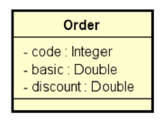
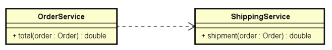

# Sobre o desafio

Deve criar um sistema para calcular o **valor total** de um pedido, considerando uma porcentagem de desconto e o frete. O cálculo do **valor total** do pedido consiste em aplicar o desconto ao **valor básico** do pedido, e adicionar o valor do frete. A regra para cálculo do frete é a seguinte:

| Valor básico do pedido (sem desconto) | Frete    |
|---------------------------------------|----------|
| Abaixo de R$ 100.00                   | R$ 20.00 | 
| De R$ 100.00 até R$ 200.00 exclusive  | R$ 12.00 |
| R$ 200.00 ou mais                     | Grátis   |

## Exemplos
### Exemplo 1:

```
ENTRADA (dados do pedido)
Código: 1034
Valor: 150.00
Porcentagem de desconto: 20.0

SAÍDA
Pedido código: 1034
Valor total: R$ 132.00
```

### Exemplo 2:

```
ENTRADA (dados do pedido)
Código: 2282
Valor: 800.00
Porcentagem de desconto: 10.0

SAÍDA
Pedido código: 2282
Valor total: R$ 720.00
```

### Exemplo 3:

```
ENTRADA (dados do pedido)
Código: 1309
Valor: 95.90
Porcentagem de desconto: 0.0

SAÍDA
Pedido código: 1309
Valor total: R$ 115.90
```
## Requisitos para a solução

Um pedido deve ser representado por um objeto conforme projeto abaixo:



A lógica do cálculo do valor total do pedido deve ser implementada por componentes (serviços), cada um com sua responsabilidade, conforme projeto abaixo:



- Serviço **OrderService**: responsável por operações referentes a pedidos.
- Serviço **ShippingService**: responsável por operações referentes a frete.

A solução deverá ser implementada em **Java com Spring Boot**. A saída deverá ser mostrada no **log do terminal** da aplicação. Cada serviço deve ser implementado como um componente registrado com **@Service**.

## Créditos

Este desafio faz parte do curso **Java Spring Professional** da **Devsuperior**, ministrado pelo Prof. Dr. **Nélio Alves**, que visa trabalhar:

1. Inversão de controle e injeção de dependência 
2. Implementação de componentes no Spring Boot

## Como executar o desafio

Pré-requisito: Java 21

````
# clonar repositório (via HTTPS)
git clone https://github.com/jonatasmateus/bds-java-spring-desafio-1

# entrar na pasta do desafio
cd bds-java-spring-desafio-1

# executar o projeto
./mvnw spring-boot:run
````
## Autor

Jonatas Mateus Souza

LinkedIn: www.linkedin.com/in/jonatasmateus 
